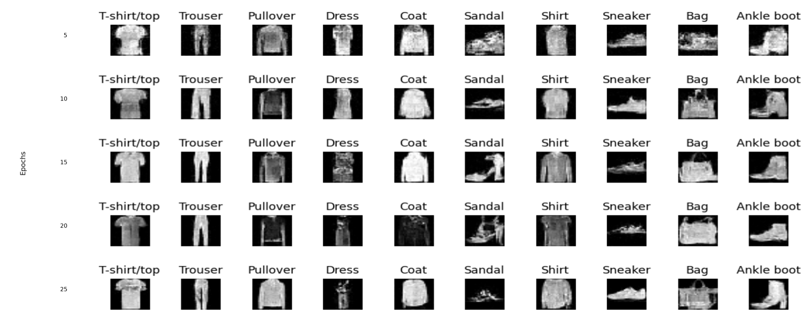
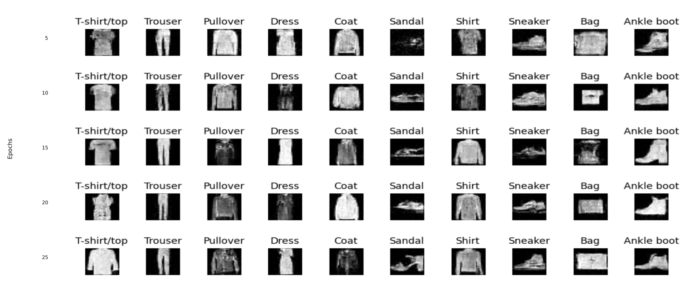

# DiT_FashionMnist

This repository provides experiments and reference code for training Diffusion Transformer (DiT) models on the FashionMNIST dataset. It contains multiple model variants, training and inference scripts, checkpoints, and utilities for reproducing results and generating sample outputs.

This README integrates implementation details, experimental findings, and results from the project report.

---

## Repository Overview

- `adaptive_layer_norm/`  
  DiT variant using adaptive layer normalization. Includes training scripts, checkpoints, logs, and sample outputs.

- `adaptive_layer_norm_zero/`  
  Variant with zero initialized adaptive layer normalization.

- `in-context_conditioning/`  
  Experiments that incorporate in-context conditioning mechanisms.

- `inference_optimization_ddim/`  
  Inference optimizations and DDIM based sampling experiments.

- `no_conditioning/`  
  DiT trained without conditioning information.

- `data/`  
  Local datasets. Contains FashionMNIST and MNIST raw IDX files used by the experiments.

Every variant directory contains its own `dit.py`, `vit_model.py`, checkpoints, and results folder.

---

## Key Implementation Details

### Direct Patch-Based Diffusion
- No VAE is used; model operates directly in pixel space
- Images (28 x 28) are split into 7 x 7 patches
- Total tokens: 16
- Embedding dimension: 256

### Diffusion Process
- DDPM framework with linear beta schedule
- Timesteps: 1000
- Model predicts noise \(\epsilon_\theta(x_t, t, y)\)

### Training Objective
- Mean Squared Error:

  \[
  L = ||\epsilon - \epsilon_\theta(x_t, t, y)||^2
  \]

---

## Model Variants

### In-Context Conditioning
- Conditioning token:

  \[
  c_{token} = TimeEmb(t) + ClassEmb(y)
  \]

- Prepended to transformer sequence

### adaLN-Zero
- Conditioning injected via adaptive layer normalization
- Includes learned scale, shift, and gating
- Improves stability and convergence

---

## Training Configuration

| Parameter | Value |
|----------|------|
| timesteps | 1000 |
| emb_dim | 256 |
| num_block | 6 |
| heads | 8 |
| ff_dim | 4 |
| epochs | 25 |
| patch_size | 7 |
| lr | 1e-3 |
| batch_size | 128 |

---

## Results

### Quantitative Results (FID)

| Model Variant | T=100 | T=500 | T=1000 |
|--------------|------|------|--------|
| In-Context Conditioning | 3.362 | 1.156 | 0.065 |
| adaLN-Zero | 2.587 | 1.029 | 0.054 |

Observations:
- Increasing inference steps improves generation quality
- adaLN-Zero consistently outperforms In-Context conditioning

### Qualitative Results
Then they will render below:

#### In-Context Conditioning


#### adaLN-Zero


#### Training Loss


---

## Inference Optimization (DDIM)

- Replaces stochastic DDPM with deterministic DDIM
- Enables step skipping

Example trade-off:

| Method | Steps | Time (s) | FID |
|--------|------|---------|-----|
| DDPM | 1000 | 216 | 0.054 |
| DDIM | 100 | 0.398 | 0.164 |

- Achieves ~500x speedup with minimal quality degradation

---

## Ablation Study

| Model | Modification | Effect |
|------|-------------|--------|
| adaLN-Zero | Remove gating (alpha) | Reduced stability, worse FID |
| In-Context | Remove class conditioning | Generates valid images but loses label control |

---

## Quick Status

- Checkpoints are located under `checkpoints/` in each variant folder, for example `dit_epoch_25.pt`.
- Sample outputs, logs, training loss, and FID measurements appear in each variant’s `results/` directory and in `dit_log.txt`.

---

## Requirements

Install Python dependencies from `requirements.txt`. Key packages include:

- torch
- torchvision
- numpy
- matplotlib
- tqdm
- torchmetrics

---

## Setup

```zsh
conda create -n dit_fmnist python=3.10 -y
conda activate dit_fmnist
pip install -r requirements.txt
```

---

## Preparing the Data

The repository includes FashionMNIST raw IDX files under `data/FashionMNIST/raw/`.

Automatic download:

```zsh
python - <<'PY'
from torchvision.datasets import FashionMNIST
FashionMNIST(root='data/FashionMNIST', train=True, download=True)
FashionMNIST(root='data/FashionMNIST', train=False, download=True)
print('Downloaded FashionMNIST to data/FashionMNIST')
PY
```

---

## How the Code Is Organized

Each experimental variant folder contains:

- `dit.py`  
- `vit_model.py`  
- `checkpoints/`  
- `results/`  

---

## Running Training

```zsh
cd adaptive_layer_norm
python dit.py
```

---

## Running Inference and Sampling

```zsh
cd adaptive_layer_norm
python dit.py
```

---

## Files of Interest

- `checkpoints/dit_epoch_25.pt`
- `results/fid_scores.txt`
- `results/loss.txt`
- `dit_log.txt`

---

## Reproducing Results

1. Install dependencies  
2. Prepare dataset  
3. Run training  
4. Monitor results  
5. Evaluate checkpoints  

---

## Troubleshooting

- Reduce batch size if GPU memory is insufficient  
- Reinstall dependencies if needed  
- Modify hyperparameters directly in `dit.py`  

---
